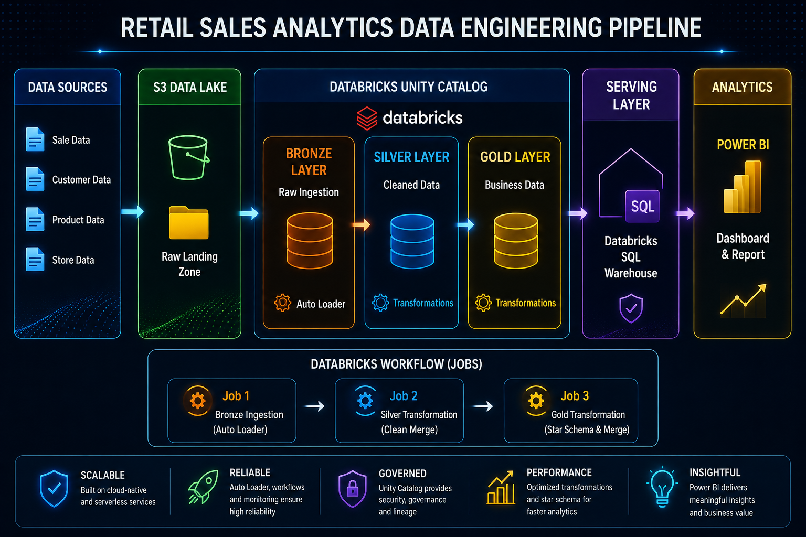

# Retail Sales Data Engineering Pipeline

### 📌 Project Overview

This project implements an end-to-end cloud data engineering pipeline for processing retail sales data using Amazon S3, Databricks, Delta Lake, and Power BI.

The pipeline follows the Medallion Architecture and is designed to support incremental data processing, data quality, deduplication, and analytical reporting.

The solution ingests customer, product, store, and sales data from Amazon S3, processes the data through Bronze, Silver, and Gold layers in Databricks, and exposes the curated Gold layer to Power BI for business intelligence and reporting.

### 🏗️ Architecture

### 🔧 Technologies Used
- **Amazon S3** — Cloud data lake and source storage
- **Databricks** — Data engineering and processing
- **PySpark** — Distributed data processing
- **Auto Loader** — Incremental file ingestion
- **Delta Lake** — Reliable storage and transactional processing
- **Databricks SQL** — Data serving
- **SQL** — Transformation and incremental loading
- **Power BI** — Data visualization and reporting
- **Databricks Jobs** — Pipeline orchestration

### 📂 Source Data

The pipeline processes four primary datasets:

#### Customers

Contains customer information such as:

- CustomerID
- CustomerName
- Region
- CustomerSegment
- SignupDate

#### Products

Contains:

- ProductID
- ProductName
- Category
- Brand
- UnitPrice

#### Stores

Contains:

- StoreID
- StoreName
- City
- Region
- StoreType

#### Sales

Contains transactional information including:

- SaleID
- CustomerID
- ProductID
- StoreID
- SaleDate
- Quantity
- UnitPrice
- Discount
- OrderStatus
- PaymentMethod
