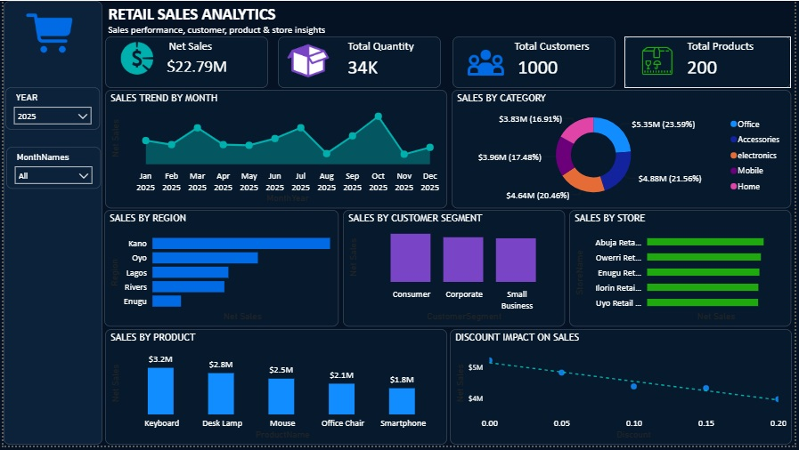
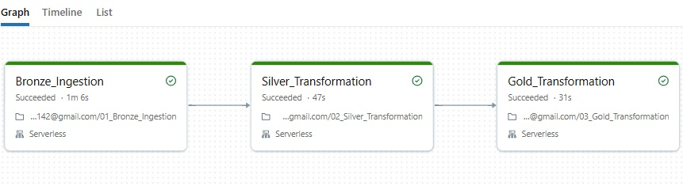

# Retail Sales Data Engineering Pipeline

### 📌 Project Overview

This project implements an end-to-end cloud data engineering pipeline for processing retail sales data using Amazon S3, Databricks, Delta Lake, and Power BI.

The pipeline follows the Medallion Architecture and is designed to support incremental data processing, data quality, deduplication, and analytical reporting.

The solution ingests customer, product, store, and sales data from Amazon S3, processes the data through Bronze, Silver, and Gold layers in Databricks, and exposes the curated Gold layer to Power BI for business intelligence and reporting.

### 🏗️ Architecture

### 🔧 Technologies Used
- **Amazon S3** — Cloud data lake and source storage
- **Databricks** — Data engineering and processing
- **PySpark** — Distributed data processing
- **Auto Loader** — Incremental file ingestion
- **Delta Lake** — Reliable storage and transactional processing
- **Databricks SQL** — Data serving
- **SQL** — Transformation and incremental loading
- **Power BI** — Data visualization and reporting
- **Databricks Jobs** — Pipeline orchestration

### 📂 Source Data

The pipeline processes four primary datasets:

#### Customers

Contains customer information such as:

- CustomerID
- CustomerName
- Region
- CustomerSegment
- SignupDate

#### Products

Contains:

- ProductID
- ProductName
- Category
- Brand
- UnitPrice

#### Stores

Contains:

- StoreID
- StoreName
- City
- Region
- StoreType

#### Sales

Contains transactional information including:

- SaleID
- CustomerID
- ProductID
- StoreID
- SaleDate
- Quantity
- UnitPrice
- Discount
- OrderStatus
- PaymentMethod

### 🥉 Bronze Layer
The Bronze layer stores data ingested from Amazon S3. Databricks Auto Loader is used to incrementally detect and ingest new files.
The Bronze layer also captures ingestion metadata such as:
- _ingestion_timestamp
- _source_file
These fields support file-level tracking and incremental processing.

### 🥈 Silver Layer
The Silver layer contains cleaned, validated, deduplicated, and incrementally processed data.
The main transformations include:
- Removing invalid records
- Trimming text fields
- Deduplicating business keys
- Standardizing dates
- Incremental file filtering
- MERGE operations into Silver tables

📋 Processed Files Control
A control table tracks successfully processed source files.
Fields include:
- table_name
- source_file
- status
- records_processed
- processed_timestamp

This provides:
- File-level processing history
- Prevention of unnecessary reprocessing
- Basic pipeline auditing
- Record-count tracking
- Improved operational visibility
The file is marked as SUCCESS only after the corresponding transformation and merge have completed successfully.

🥇 Gold Layer
The Gold layer is designed specifically for analytics and Power BI. A dimensional/star-schema model is created consisting of:

#### Dimension Tables
- DIM_CUSTOMER
- DIM_PRODUCT
- DIM_STORE
- DIM_DATE

#### Fact Table
- FACT_SALES
The fact table contains sales transactions and references the appropriate dimensions. This structure makes the data easier to consume for business intelligence and improves the organization of analytical queries.

### 📊 Power BI
The Gold layer is exposed through the Databricks SQL Warehouse and connected to Power BI. The Power BI dashboard provides an analytical view of retail performance.

### ⚙️ Orchestration
The complete pipeline is orchestrated using Databricks Jobs. The job contains three dependent notebook tasks:
- Bronze Ingestion
- Silver Transformation
- Gold Transformation
The tasks are configured with dependencies so that: Silver runs only after Bronze succeeds. Gold runs only after Silver succeeds. The complete pipeline can run automatically according to a schedule. This removes the need to manually execute individual notebooks.

### 📈 Business Value
The solution transforms raw retail data into a reliable analytical platform that enables users to:
- Monitor sales performance
- Analyze customer behavior
- Compare product performance
- Evaluate store performance
- Analyze regional sales
- Track sales trends over time
- Build interactive Power BI reports
The incremental architecture also reduces unnecessary reprocessing as new files arrive.

### 🎯 Conclusion
This project demonstrates an end-to-end modern data engineering solution for retail analytics.

It combines Amazon S3, Databricks Auto Loader, PySpark, Delta Lake, SQL, incremental processing, data quality, dimensional modeling, Databricks Jobs, and Power BI to transform raw source files into business-ready analytical data.

The architecture is designed to be incremental, auditable, scalable, and suitable for automated reporting, while the Bronze → Silver → Gold structure separates raw ingestion, data transformation, and analytical consumption.
